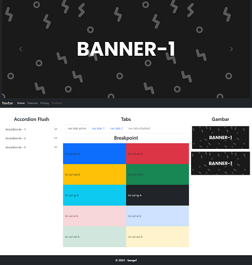
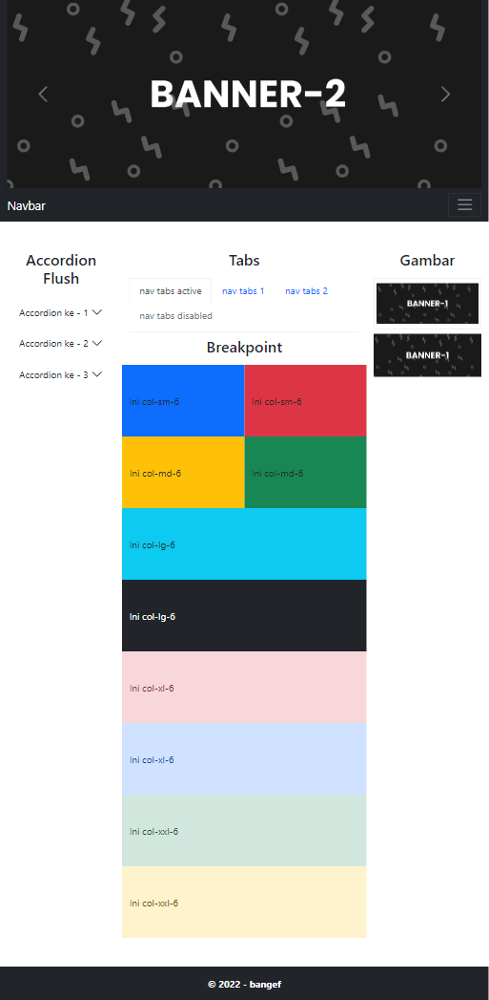
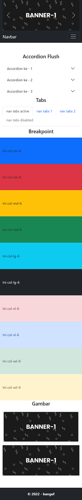

## _User Interface Tugas Responsive Web Desain_

>Ficri Hanip
>STT Terpadu Nurul Fikri

### Deskripsi tugas :
* Membuat Layouting web terdiri dari banner, navbar, 2 sidebar, 1 main, footer
* Eksplore bootsrap 5

### Hasil
#### Screenshoot RWD *DESKTOP*

#### Screenshoot RWD *TAB PORTAIT*

#### Screenshoot RWD *TAB LANDSCAPE*

#### Screenshoot RWD *MOBILE*

